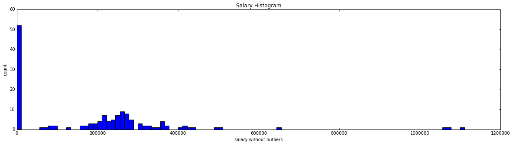

### Note:

This is **the third version** of the final project. Below is the list of modifications I made from the second version.

- Included graphs showing the scores of each K value for **SelectKBest**.
- In **the second version**, due to the randomness, I decided not to use the **feature importances** in **Decision Tree** when selecting the best features. In this version, I used this method to remove lowest one at a time iteratively.
- Enhanced the performance by using **cv** parameter in **GridSearchCV**.
- Used **Pipeline** to rescale the data set more easily.
- Used **KNeighborClassifier** instead of **KNeighborRegressor**.
- Only used **Decision Tree** and **KNN** for the classifiers. Excluded **GaussianNB**, **SVM** and **Logistic Regression**.
- Included the importance of **parameter tuning** in the **Final Thoughts**.

# Identifying POI from Enron Dataset
### Final Project - Machine Learning Course
### Udacity Data Analyst Nanodegree

This is the final project for the machine learning course. Enron financial data and email data will be investigated to find the list of person of interest (POI) who were involved in the fraud activities.

Below is the order of the investigation process I will employ for this final project.
- Univariate analysis
    - Process the dataset (taking care of missing values and outliers)
    - Select good features that don't have too many zeros or missing values
    - Calculate accuracy, precision and recall for each feature I selected using classifiers with default parameters.
- Bivariate analysis 
    - Use features that show the high scores from the univariate analysis
    - Calculate accuracy, precision and recall from a pair of features using more classifiers and various parameters.
- Multivariate analysis
    - Calculate accuracy, precision and recall from features with the best scores from univariate and bivariate analysis.

In the end, I will choose the combination of features and classifier that shows the best scores.

First, necessary Libraries will be loaded.


```python
#!/usr/bin/python

import sys
import pickle
import pprint
import matplotlib.pyplot as plt
import numpy as np

### Setting the path
sys.path.append("../tools/")

### These are the scripts given in the class
from feature_format import featureFormat, targetFeatureSplit
from tester import dump_classifier_and_data
```

Load the dictionary containing the dataset.


```python
### Load the dictionary containing the dataset
with open("final_project_dataset.pkl", "r") as data_file:
    data_dict = pickle.load(data_file)
```


```python
len(data_dict)
```


    146


There are total 146 number of data in data_dict. I am going to print out the first two of the data from data_dict to see how the dictionary looks like.


```python
stop = 0
for k, v in data_dict.iteritems():
    print k
    pprint.pprint(v)
    if stop == 1:
        break
    stop += 1
```

    METTS MARK
    {'bonus': 600000,
     'deferral_payments': 'NaN',
     'deferred_income': 'NaN',
     'director_fees': 'NaN',
     'email_address': 'mark.metts@enron.com',
     'exercised_stock_options': 'NaN',
     'expenses': 94299,
     'from_messages': 29,
     'from_poi_to_this_person': 38,
     'from_this_person_to_poi': 1,
     'loan_advances': 'NaN',
     'long_term_incentive': 'NaN',
     'other': 1740,
     'poi': False,
     'restricted_stock': 585062,
     'restricted_stock_deferred': 'NaN',
     'salary': 365788,
     'shared_receipt_with_poi': 702,
     'to_messages': 807,
     'total_payments': 1061827,
     'total_stock_value': 585062}
    BAXTER JOHN C
    {'bonus': 1200000,
     'deferral_payments': 1295738,
     'deferred_income': -1386055,
     'director_fees': 'NaN',
     'email_address': 'NaN',
     'exercised_stock_options': 6680544,
     'expenses': 11200,
     'from_messages': 'NaN',
     'from_poi_to_this_person': 'NaN',
     'from_this_person_to_poi': 'NaN',
     'loan_advances': 'NaN',
     'long_term_incentive': 1586055,
     'other': 2660303,
     'poi': False,
     'restricted_stock': 3942714,
     'restricted_stock_deferred': 'NaN',
     'salary': 267102,
     'shared_receipt_with_poi': 'NaN',
     'to_messages': 'NaN',
     'total_payments': 5634343,
     'total_stock_value': 10623258}
    

The keys of data_dict are the names of people and the values are various features. Every feature except poi and email_address are numerical values. It looks like it is either a number of 'NaN' when the data is missing. And poi is a boolean value that I can use to find POI's.


```python
### Finding the number of features
for k,v in data_dict.iteritems():
    print "The number of features:", len(v)
    features_list = v.keys() # features are saved separately for later use
    
    ### Save the raw features
    total_features_list = v.keys()
    break
```

    The number of features: 21
    

There are total 21 features in the dataset. I will ignore "email_address" because they are not numerical values. And I will ingore 'other' as well because I don't know what this is.


```python
### Removing poi and email_address
try:
    features_list.remove("email_address")
    features_list.remove("other")
except:
    pass
try:
    total_features_list.remove("email_address")
    total_features_list.remove("other")
except:
    pass

### Convert data_dict into numpy array
data = featureFormat(data_dict, features_list)
print "The type of data:", type(data)
print "The total number of data", data.shape
```

    The type of data: <type 'numpy.ndarray'>
    The total number of data (145, 19)
    

Now the data_dict is converted to numpy array. And it contains 145 rows and 19 columns. 
featureFormat ignores the "NaN" values and creates numpy array that I can use it for the analysis more easily.

Using data numpy array I will check the number of poi's and non-poi's.


```python
### Finding the index of poi
poi_ind = features_list.index("poi")

### Print out the number of poi and non-poi
print "The total number of poi:", np.sum(data[:,poi_ind])
print "The total number of non-poi:", np.size(data[:,poi_ind]) - np.sum(data[:,poi_ind])
```

    The total number of poi: 18.0
    The total number of non-poi: 127.0
    

There are total **18 POI** and **127 non-POI**.


```python
### Move poi column to the end
### data
tmp_data = data
tmp_data[:,-1] = data[:,poi_ind]
tmp_data[:,poi_ind] = data[:,-1]
data = tmp_data

### features_list
tmp = features_list[-1]
features_list[poi_ind] = tmp
features_list[-1] = "poi"

### Reassign poi index
poi_ind = features_list.index("poi")
```

I moved poi column to the end to use the data more easily.

## Plotting

From now on, I will start drawing various plots for univariate analysis and bivariate analysis.
I will draw histograms for each feature first.


```python
### Create new features list without poi
features_list_new = [ii for ii in features_list if ii != "poi"]

%matplotlib inline
### 20 histograms for features
plt.rcParams["figure.figsize"] = (20,20)
f, axarr = plt.subplots(6, 3)

### the histogram of the data
### x: x coordinate values, y: y coordinate values
### r: row index, c: column index
### title: title of a subplot
def subplot_histogram(x, bins, r, c, title):
    axarr[r, c].hist(x, bins = bins)
    axarr[r, c].set_title(title)
    axarr[r, c].set_ylabel("count")

for i in range(len(features_list_new)):
    subplot_histogram(data[:,i],50,i/3,i%3,features_list_new[i])

plt.show()
```


Above diagrams show 19 histograms. I first created new list of features excluding poi because array of poi consists of only true or false so it won't provide an insightful histogram. 

Looking at these histograms, I can see there are outliers for every feature.

I will look into salary more deeply and see if there is any interesting thing going on.


```python
%matplotlib inline
### Find indices for salary
salary_ind = features_list.index("salary")

### Set the size of the plot
plt.rcParams["figure.figsize"] = (20,5)

### Draw Salary histogram
plt.hist(data[:,salary_ind], bins=100)
plt.xlabel("salary")
plt.ylabel("count")
plt.title("Salary Histogram")
plt.show()
```


Now I will get rid of the outlier above 2.5e7 and replot the histogram


```python
### Total sum of salaries
import numpy as np
print np.sum(data[:,salary_ind]), "is the total sum of salaries"

### Create new array that contains salar values without outliers
salary_no_outliers = []
for i in data[:,salary_ind]:
    if i < 2.5e7:
        salary_no_outliers.append(i)
    else:
        print i, "is removed"

### Draw Salary histogram
plt.hist(salary_no_outliers, bins=100)
plt.xlabel("salary without outliers")
plt.ylabel("count")
plt.title("Salary Histogram")
plt.show()
```

    53408458.0 is the total sum of salaries
    26704229.0 is removed
    





The outlier removed is half of the total sum of salary array, which means someone added a total sum of salaries into the data. I believe that in data_dict there is a key that contains the sum of every feature.


```python
for k,v in data_dict.iteritems():
    if v["salary"] == 26704229.0:
        print k,v
```

    TOTAL {'salary': 26704229, 'to_messages': 'NaN', 'deferral_payments': 32083396, 'total_payments': 309886585, 'exercised_stock_options': 311764000, 'bonus': 97343619, 'restricted_stock': 130322299, 'shared_receipt_with_poi': 'NaN', 'restricted_stock_deferred': -7576788, 'total_stock_value': 434509511, 'expenses': 5235198, 'loan_advances': 83925000, 'from_messages': 'NaN', 'other': 42667589, 'from_this_person_to_poi': 'NaN', 'poi': False, 'director_fees': 1398517, 'deferred_income': -27992891, 'long_term_incentive': 48521928, 'email_address': 'NaN', 'from_poi_to_this_person': 'NaN'}
    

As I expected one of the keys in data_dict is TOTAL. I will create a new dictionary that excludes this key.


```python
### New data_dict excluding TOTAL key
data_dict_new = {}

for k, v in data_dict.iteritems():
    if k != "TOTAL":
        data_dict_new[k] = v

### Print out the new data_dict length
print "The length of the new data_dict:", len(data_dict_new)
    
```

    The length of the new data_dict: 145
    

Now there are 145 data in the data_dict_new. I will graph the histograms again.


```python
### Convert data_dict_new into numpy array
data = featureFormat(data_dict_new, features_list)

%matplotlib inline
### 20 histograms for features
plt.rcParams["figure.figsize"] = (20,20)
f, axarr = plt.subplots(6, 3)

### the histogram of the data
### x: x coordinate values, y: y coordinate values
### r: row index, c: column index
### title: title of a subplot
def subplot_histogram(x, bins, r, c, title):
    axarr[r, c].hist(x, bins = bins)
    axarr[r, c].set_title(title)
    axarr[r, c].set_ylabel("count")

for i in range(len(features_list_new)):
    subplot_histogram(data[:,i],50,i/3,i%3,features_list_new[i])

plt.show()
```


The histograms are better than before. Although there are still outliers in histograms, getting rid of them might not be a good idea because those values may be helpful identifying POI's.

I suspect that some of these features will have too many zeros because featureFormat function convert NaN to zero in some cases. I will print out the number of zeros for each feature. 


```python
### defining function that counts zeros
def counting_zeros(data, features_list, feature):
    total_count = 0
    count = 0
    feature_data = data[:,features_list.index(feature)]
    for i in feature_data:
        total_count += 1
        if i == 0:
            count += 1
    print "{}: {}, {}%".format(feature,count, int(float(count)*100/float(total_count)))

### Printing out the number of zeros for each feature
for i in features_list[:-1]:
    counting_zeros(data, features_list, i)
```

    salary: 50, 34%
    to_messages: 58, 40%
    deferral_payments: 106, 73%
    total_payments: 20, 13%
    exercised_stock_options: 43, 29%
    bonus: 63, 43%
    restricted_stock: 35, 24%
    shared_receipt_with_poi: 58, 40%
    restricted_stock_deferred: 127, 88%
    total_stock_value: 19, 13%
    expenses: 50, 34%
    loan_advances: 141, 97%
    from_messages: 58, 40%
    from_this_person_to_poi: 78, 54%
    from_poi_to_this_person: 70, 48%
    director_fees: 128, 88%
    deferred_income: 96, 66%
    long_term_incentive: 79, 54%
    

I will ignore features with more than 60% of zeros from now on.

### Features that will be ignored:
- deferral_payments
- restricted_stock_deferred
- loan_advances
- director_fees
- deferred_income

I will recreate data numpy array and features_list array that exclude the features above.


```python
### Save the original features_list before change
features_list_original = features_list

### list of features with too many zeros
too_many_zeros = ["deferral_payments", 
                  "restricted_stock_deferred",
                  "loan_advances",
                  "director_fees",
                  "deferred_income"]

### remove the above features from features_list
for i in too_many_zeros:
    if i in features_list:
        features_list.remove(i)
        
### Convert data_dict_new into numpy array
data = featureFormat(data_dict_new, features_list)
print data.shape
```

    (144, 14)
    

Now the number of columns of data is reduced to 14.

### Checking Scores

Now I am going to test each feature using GaussianNB and check the accuracy, precision and recall. Then I will use features with high values for later use.

I will employ tester functions from tester.


```python
### Import functions from tester_edited.py
from tester_edited import load_classifier_and_data, test_classifier
from sklearn.cross_validation import StratifiedShuffleSplit
```

This will be a repetitive process so I will create a function to do this. The code is from **tester.py**.


```python
### the code is from "poi_id.py" from final_project folder.
### this function will split the data into test and train
### apply classifier and calculate the accuracy, precision and recall
def test(features_list, clf, print_result=False, draw_graph=False, rescale=False):
    ### Store to my_dataset for easy export below.
    my_dataset = data_dict
    
    ### Extract features and labels from dataset for local testing
    data = featureFormat(my_dataset, features_list, sort_keys = True)
    labels, features = targetFeatureSplit(data)
    
#     ### Split train and test by 30 %
#     from sklearn.cross_validation import train_test_split
#     features_train, features_test, labels_train, labels_test = \
#         train_test_split(features, labels, test_size=0.3, random_state=42)
        
    ### Dump the data to the local files
    dump_classifier_and_data(clf, my_dataset, features_list)
    
    ### Load the data from the local files
    clf, dataset, feature_list = load_classifier_and_data()
    
    ### Print out the result
    scores = test_classifier(
        clf, dataset, feature_list, 
        print_result=print_result, draw_graph=draw_graph, rescale=rescale)
    return scores

### import GaussianNB
from sklearn.naive_bayes import GaussianNB

### import Decision Tree
from sklearn import tree

### This function only test the data using
### GaussianNB and Decision Tree
def classify_simple(features_list, print_result=False):
    print "Features list:", features_list[1:]
    
    ### Set GaussianNB
    clf_NB = GaussianNB()

    ### Set Decision Tree
    clf_tree = tree.DecisionTreeClassifier()
    
    ### Call test function and print out test
    scores_NB = test(features_list,clf_NB, print_result=print_result)
    tree_NB = test(features_list,clf_tree, print_result=print_result)
    return [ scores_NB, tree_NB ]
```

I created a function that can show the accuracy, precision and recall values from features list input. The test function is mainly from the "poi-id.py" file from the final project folder. I creates clf for classifier, features list and dataset so that it can be loaded in test_classifier function in "tester.py" file. Note that the validation used in this code is Train/Test split. The purpose is not to get the largest scores but to select features that show the high scores compared to the others. So I don't use other cross validation for now. For the same reason, I don't specify any parameter for classifiers. The parameters will be adjusted at a later section.


```python
### Always put poi at the zeroth index
classify_simple(["poi", "salary"],print_result=True)
```

    Features list: ['salary']
    
    GaussianNB()
    
    	Best parameters:
    	No GridSearch
    
    	Accuracy: 0.25560	Precision: 0.18481	Recall: 0.79800	F1: 0.30011	F2: 0.47968
    	Total predictions: 20000	True positives: 3192	False positives: 14080	False negatives:  808	True negatives: 1920
    
    
    DecisionTreeClassifier(class_weight=None, criterion='gini', max_depth=None,
                max_features=None, max_leaf_nodes=None, min_samples_leaf=1,
                min_samples_split=2, min_weight_fraction_leaf=0.0,
                presort=False, random_state=None, splitter='best')
    
    	Best parameters:
    	No GridSearch
    
    	Accuracy: 0.69210	Precision: 0.23619	Recall: 0.24150	F1: 0.23881	F2: 0.24042
    	Total predictions: 20000	True positives:  966	False positives: 3124	False negatives: 3034	True negatives: 12876
    
    


    [[0.2556, 0.18480778138026865, 0.798, {}],
     [0.6921, 0.23618581907090463, 0.2415, {}]]


I ran the function using poi and salary. Fortunately the function works.

I will use this function for all the other features.


```python
### Iterate over the features_list
scores_list = {}
for i in features_list[:-1]:
    scores_list[i] = classify_simple(["poi", i])
```

    Features list: ['salary']
    Features list: ['to_messages']
    Got a divide by zero when trying out: GaussianNB()
    Precision or recall may be undefined due to a lack of true positive predicitons.
    
    Features list: ['total_payments']
    Features list: ['exercised_stock_options']
    Features list: ['bonus']
    Features list: ['restricted_stock']
    Features list: ['shared_receipt_with_poi']
    Got a divide by zero when trying out: GaussianNB()
    Precision or recall may be undefined due to a lack of true positive predicitons.
    
    Features list: ['total_stock_value']
    Features list: ['expenses']
    Features list: ['from_messages']
    Got a divide by zero when trying out: GaussianNB()
    Precision or recall may be undefined due to a lack of true positive predicitons.
    
    Features list: ['from_this_person_to_poi']
    Got a divide by zero when trying out: GaussianNB()
    Precision or recall may be undefined due to a lack of true positive predicitons.
    
    Features list: ['from_poi_to_this_person']
    Features list: ['long_term_incentive']
    


```python
### Print out scores of each feature
print "      Accuarcy Precision Recall"
for k,v in scores_list.iteritems():
    print k
    if v[0] == None:
        print "NB     ---------None---------"
    else:
        print "NB     {0:.4f}  {1:.4f}  {2:.4f}".format(v[0][0], v[0][1], v[0][2])
    print "tree   {0:.4f}  {1:.4f}  {2:.4f}".format(v[1][0], v[1][1], v[1][2])
```

          Accuarcy Precision Recall
    salary
    NB     0.2556  0.1848  0.7980
    tree   0.6921  0.2362  0.2415
    to_messages
    NB     ---------None---------
    tree   0.7371  0.0856  0.1410
    total_payments
    NB     0.7631  0.0694  0.0435
    tree   0.7393  0.0804  0.0665
    bonus
    NB     0.3780  0.2223  0.7200
    tree   0.7623  0.4427  0.2685
    total_stock_value
    NB     0.8406  0.3200  0.0320
    tree   0.7584  0.2300  0.2430
    shared_receipt_with_poi
    NB     ---------None---------
    tree   0.8421  0.3020  0.3210
    exercised_stock_options
    NB     0.8994  0.2108  0.0390
    tree   0.8571  0.2686  0.3320
    from_messages
    NB     ---------None---------
    tree   0.7259  0.0067  0.0100
    from_this_person_to_poi
    NB     ---------None---------
    tree   0.7444  0.0218  0.0180
    long_term_incentive
    NB     0.3980  0.1471  0.6700
    tree   0.6943  0.0250  0.0300
    expenses
    NB     0.3068  0.1885  0.7460
    tree   0.6466  0.1295  0.1340
    restricted_stock
    NB     0.7380  0.1013  0.0560
    tree   0.7297  0.1196  0.0765
    from_poi_to_this_person
    NB     0.7365  0.0263  0.0015
    tree   0.6425  0.1312  0.0765
    

Notice that those features where NB score is zero have zeros more than 50%. Initially I thought removing features with zeros more than 60% might be sufficient but apparently I should have set my threshold to be 60% instead of 50%.

And I will remove total_payments from my list because this feature has precision and recall values less than 1%.


```python
### list of features with too many zeros above 50%
too_many_zeros = ["to_messages",
                  "shared_receipt_with_poi",
                  "from_messages",
                  "from_this_person_to_poi",
                  "total_payments"]

### remove the above features from features_list
for i in too_many_zeros:
    if i in features_list:
        features_list.remove(i)
        
### Convert data_dict_new into numpy array
data = featureFormat(data_dict_new, features_list)
print "Shape of data:", data.shape
pprint.pprint(features_list)
```

    Shape of data: (139, 9)
    ['salary',
     'exercised_stock_options',
     'bonus',
     'restricted_stock',
     'total_stock_value',
     'expenses',
     'from_poi_to_this_person',
     'long_term_incentive',
     'poi']
    

The number of columns are reduced to 9 including poi. Let's print the result again only from these features.


```python
### Print out scores of each feature
print "      Accuarcy Precision Recall"
for k,v in scores_list.iteritems():
    if k in features_list:
        print k
        if v[0] == None:
            print "NB     ---------None---------"
        else:
            print "NB     {0:.4f}  {1:.4f}  {2:.4f}".format(v[0][0], v[0][1], v[0][2])
        print "tree   {0:.4f}  {1:.4f}  {2:.4f}".format(v[1][0], v[1][1], v[1][2])
```

          Accuarcy Precision Recall
    salary
    NB     0.2556  0.1848  0.7980
    tree   0.6921  0.2362  0.2415
    bonus
    NB     0.3780  0.2223  0.7200
    tree   0.7623  0.4427  0.2685
    total_stock_value
    NB     0.8406  0.3200  0.0320
    tree   0.7584  0.2300  0.2430
    exercised_stock_options
    NB     0.8994  0.2108  0.0390
    tree   0.8571  0.2686  0.3320
    long_term_incentive
    NB     0.3980  0.1471  0.6700
    tree   0.6943  0.0250  0.0300
    expenses
    NB     0.3068  0.1885  0.7460
    tree   0.6466  0.1295  0.1340
    restricted_stock
    NB     0.7380  0.1013  0.0560
    tree   0.7297  0.1196  0.0765
    from_poi_to_this_person
    NB     0.7365  0.0263  0.0015
    tree   0.6425  0.1312  0.0765
    

From the result above, the features with the best scores are **bonus**, **exercised_stock_options** and **total_stock_value**.
I will use these features as my main dependent variables for the bivariate analysis.

## Selecting features using SelectKBest and Decision Tree Features Importance

The above selection is choosing the features with few zeros. However, having many zeros not necessarily means the data is bad. 

In the previous version, I found **14** features with the best scores using **SelectKBest**. And **14** is a number I chose randomly so it doesn't have any significance. In this version, I will find the number that maximize the performance using **SelectKBest**.


```python
total_features_list
```


    ['salary',
     'to_messages',
     'deferral_payments',
     'total_payments',
     'exercised_stock_options',
     'bonus',
     'restricted_stock',
     'shared_receipt_with_poi',
     'restricted_stock_deferred',
     'total_stock_value',
     'expenses',
     'loan_advances',
     'from_messages',
     'from_this_person_to_poi',
     'poi',
     'director_fees',
     'deferred_income',
     'long_term_incentive',
     'from_poi_to_this_person']


```python
### Convert data_dict_new into numpy array
total_data = featureFormat(data_dict_new, total_features_list)

print total_data.shape

### Extract features from the data
features = total_data
features = np.delete(features, total_features_list.index("poi"), 1)

### Extract a label from the data
label = total_data[:,total_features_list.index("poi")]

### Rescale features
from sklearn.preprocessing import MinMaxScaler
min_max_scaler = MinMaxScaler()
features = min_max_scaler.fit_transform(features) 

### Import SelectKBest
from sklearn.feature_selection import SelectKBest
from sklearn.feature_selection import f_classif

pre_selected_list = []
features_by_importance = []
for k in range(1,19):
    selector = SelectKBest(f_classif, k=k)
    selector = selector.fit(features,label)

    features_list_wo_poi = [i for i in total_features_list if i!="poi"] ### features list without poi

    ### Print features chosen by SelectKBest
    selected_list = [features_list_wo_poi[i] for i in range(len(features_list_wo_poi)) if selector.get_support()[i]]
    
    print "K:", k
    for i in selected_list:
        if i not in pre_selected_list:
            print "\t", i
            features_by_importance.append(i)
        
    pre_selected_list = selected_list
```

    (144, 19)
    K: 1
    	exercised_stock_options
    K: 2
    	total_stock_value
    K: 3
    	bonus
    K: 4
    	salary
    K: 5
    	deferred_income
    K: 6
    	long_term_incentive
    K: 7
    	restricted_stock
    K: 8
    	total_payments
    K: 9
    	shared_receipt_with_poi
    K: 10
    	loan_advances
    K: 11
    	expenses
    K: 12
    	from_poi_to_this_person
    K: 13
    	from_this_person_to_poi
    K: 14
    	director_fees
    K: 15
    	to_messages
    K: 16
    	deferral_payments
    K: 17
    	from_messages
    K: 18
    	restricted_stock_deferred
    

The above shows the features that are selected by its importance. The best feature is **exercised_stock_option** and the next best feature is **total_stock_value** and so on. Now I will calculate the scores for each **k** value using **Decision Tree**.


```python
### Import Cross Validation
from sklearn.cross_validation import StratifiedShuffleSplit

### Import MinMaxScaler
from sklearn.preprocessing import MinMaxScaler
min_max_scaler = MinMaxScaler()

### Import DecisionTree Classifier
clf = tree.DecisionTreeClassifier(criterion='gini', splitter='random', min_samples_split=5)

### Use pipeline
from sklearn.pipeline import Pipeline
pipe = Pipeline(steps=[('minmaxer', min_max_scaler), ('clf', clf)])

### Set up the print format
PERF_FORMAT_STRING = "\
\tAccuracy: {:>0.{display_precision}f}\tPrecision: {:>0.{display_precision}f}\t\
Recall: {:>0.{display_precision}f}\tF1: {:>0.{display_precision}f}\tF2: {:>0.{display_precision}f}"
RESULTS_FORMAT_STRING = "\tTotal predictions: {:4d}\tTrue positives: {:4d}\tFalse positives: {:4d}\
\tFalse negatives: {:4d}\tTrue negatives: {:4d}"

### Set up the arrays for precision, recall and F1
precision_list = []
recall_list = []
f1_list = []

### Calculate scores for each K value
for i in range(len(features_by_importance)):
    selected_features_list = features_by_importance[:(i+1)]
    selected_features_list.insert(0,'poi')
    selected_data = featureFormat(data_dict_new, selected_features_list)
    
    ### Split the data into labels and features
    labels, features = targetFeatureSplit(selected_data)
    
    cv = StratifiedShuffleSplit(labels, 1000, random_state = 42)
    true_negatives = 0
    false_negatives = 0
    true_positives = 0
    false_positives = 0

    for train_idx, test_idx in cv: 
        features_train = []
        features_test  = []
        labels_train   = []
        labels_test    = []
        for ii in train_idx:
            features_train.append( features[ii] )
            labels_train.append( labels[ii] )
        for jj in test_idx:
            features_test.append( features[jj] )
            labels_test.append( labels[jj] )

            features_test.append( features[jj])
            labels_test.append( labels[jj] )

        
        ### fit the classifier using training set, and test on test set
        pipe.fit(features_train, labels_train)
        try:
            print clf.best_params_
            for k,v in clf.best_params_.iteritems():
                if k in best_params_collector:
                    best_params_collector[k].append(v)
                else:
                    best_params_collector[k] = [v]
        except:
            pass
            
        predictions = pipe.predict(features_test)
        for prediction, truth in zip(predictions, labels_test):
            ### Assign prediction either 0 or 1
            if prediction < .5:
                prediction = 0
            else:
                prediction = 1

            if prediction == 0 and truth == 0:
                true_negatives += 1
            elif prediction == 0 and truth == 1:
                false_negatives += 1
            elif prediction == 1 and truth == 0:
                false_positives += 1
            elif prediction == 1 and truth == 1:
                true_positives += 1
    try:
        total_predictions = true_negatives + false_negatives + false_positives + true_positives
        accuracy = 1.0*(true_positives + true_negatives)/total_predictions
        precision = 1.0*true_positives/(true_positives+false_positives)
        recall = 1.0*true_positives/(true_positives+false_negatives)
        f1 = 2.0 * true_positives/(2*true_positives + false_positives+false_negatives)
        f2 = (1+2.0*2.0) * precision*recall/(4*precision + recall)
        
        print selected_features_list[-1]
        print PERF_FORMAT_STRING.format(accuracy, precision, recall, f1, f2, display_precision = 5)
        
        precision_list.append(precision)
        recall_list.append(recall)
        f1_list.append(f1)
        
    except:
        print "Precision or recall may be undefined due to a lack of true positive predicitons.\n"
```

    exercised_stock_options
    	Accuracy: 0.91600	Precision: 0.58676	Recall: 0.25700	F1: 0.35744	F2: 0.28954
    total_stock_value
    	Accuracy: 0.83269	Precision: 0.41117	Recall: 0.20250	F1: 0.27136	F2: 0.22538
    bonus
    	Accuracy: 0.84115	Precision: 0.47486	Recall: 0.30700	F1: 0.37291	F2: 0.33036
    salary
    	Accuracy: 0.82315	Precision: 0.39252	Recall: 0.27300	F1: 0.32203	F2: 0.29070
    deferred_income
    	Accuracy: 0.82700	Precision: 0.35568	Recall: 0.26000	F1: 0.30040	F2: 0.27478
    long_term_incentive
    	Accuracy: 0.82164	Precision: 0.33554	Recall: 0.25350	F1: 0.28881	F2: 0.26653
    restricted_stock
    	Accuracy: 0.82064	Precision: 0.33505	Recall: 0.25950	F1: 0.29248	F2: 0.27176
    total_payments
    	Accuracy: 0.82747	Precision: 0.32029	Recall: 0.26200	F1: 0.28823	F2: 0.27190
    shared_receipt_with_poi
    	Accuracy: 0.82160	Precision: 0.30507	Recall: 0.26450	F1: 0.28334	F2: 0.27173
    loan_advances
    	Accuracy: 0.82313	Precision: 0.31268	Recall: 0.27250	F1: 0.29121	F2: 0.27969
    expenses
    	Accuracy: 0.82460	Precision: 0.32185	Recall: 0.28500	F1: 0.30231	F2: 0.29168
    from_poi_to_this_person
    	Accuracy: 0.81860	Precision: 0.30691	Recall: 0.28650	F1: 0.29635	F2: 0.29036
    from_this_person_to_poi
    	Accuracy: 0.81920	Precision: 0.29841	Recall: 0.26350	F1: 0.27987	F2: 0.26981
    director_fees
    	Accuracy: 0.82040	Precision: 0.30913	Recall: 0.28100	F1: 0.29439	F2: 0.28621
    to_messages
    	Accuracy: 0.81613	Precision: 0.29084	Recall: 0.26350	F1: 0.27650	F2: 0.26855
    deferral_payments
    	Accuracy: 0.82100	Precision: 0.30529	Recall: 0.26850	F1: 0.28571	F2: 0.27513
    from_messages
    	Accuracy: 0.82127	Precision: 0.31094	Recall: 0.28000	F1: 0.29466	F2: 0.28569
    restricted_stock_deferred
    	Accuracy: 0.82173	Precision: 0.31194	Recall: 0.27950	F1: 0.29483	F2: 0.28544
    

Scores for each **K** value are calculated above. The feature is appended to the list and the scores are calculated one at a time. According to the result, **Recall** is the highest when **K** is 3.

Let's graph the result.


```python
%matplotlib inline
### Set the size of the plot
plt.rcParams["figure.figsize"] = (10,6)

### Set up the x-axis
k_values = range(1,len(recall_list)+1)

### Draw Salary histogram
plt.plot(k_values, precision_list, k_values, recall_list, k_values, f1_list)

x = [1,18]
y = [.3,.3]
plt.plot(x,y)

plt.xlim([1,18])

plt.legend(['precision','recall','f1'])
plt.xlabel("K")
plt.ylabel("Scores")
plt.title("Scores for each K value")
plt.show()
```


The graph above shows the result more visually. First of all the **Precision** is exceptionally high when **K** is 1. However, the **Recall** is the lowest at this point. This means that the model is good picking up the true POIs but it is not good at choosing all of the POIs. For example, if there are 10 POIs then the model chooses 2 or 3 of them correctly but misses other POIs. So it is important to consider **Recall** value as well when evaluating the performance.

I drew a horizontal line at **0.3** because it is the threshold given from the rubric. There is only 1 value of **K** when all of these scores are above **0.3** and that is when **K** is 3.

These are the features selected by **SelectKBest**.

    - exercised_stock_options
    - total_stock_value
    - bonus

Now I will choose the best features using **Feature Importance** in **Decision Tree** algorithm.

Below is the process I will employ to find the best features using **Feature Importance**.

 1. Start from the list containing all of the features.
 2. Calculate the scores with the list using **Decision Tree**.
 3. Calculate **Feature Importance** for each feature in the list.
 4. Drop the feature with the lowest **Importance**.
 5. Go back to **step 2** and repeat the process.


```python
### Use GridSearchCV to find the best parameters
from sklearn.grid_search import GridSearchCV

### Import DecisionTree Classifier
clf = tree.DecisionTreeClassifier()
param_grid = {
    'criterion': ['gini', 'entropy'],
    'splitter' : ['best', 'random'],
    'min_samples_split': range(2,9)
      }

### Set up the arrays for precision, recall and F1
precision_list = []
recall_list = []
f1_list = []

if 'poi' not in total_features_list:
    total_features_list.append('poi')
    
selected_features_list = [i for i in total_features_list if i != 'poi']
features_by_importance = []

### Calculate scores for each K value
for i in range(len(total_features_list)-1):
    print 
    
    try:
        print "Dropped Feature:", features_by_importance[-1]
    except:
        pass
    
    selected_features_list_with_poi = ['poi']
    selected_features_list_with_poi.extend(selected_features_list)
    
    selected_data = featureFormat(data_dict_new, selected_features_list_with_poi)
    
    ### Split the data into labels and features
    labels, features = targetFeatureSplit(selected_data)
    
    ### Recale the features
    features = min_max_scaler.fit_transform(features)

    cv = StratifiedShuffleSplit(labels, 100, random_state = 42)
    
    clf_grid = GridSearchCV(clf, param_grid, cv = cv, scoring = 'recall')
    
    clf_grid.fit(features, labels)
    
    print clf_grid.best_params_
    
    clf.set_params(criterion=clf_grid.best_params_["criterion"],
                   splitter=clf_grid.best_params_["splitter"],
                   min_samples_split=clf_grid.best_params_["min_samples_split"])
    
    true_negatives = 0
    false_negatives = 0
    true_positives = 0
    false_positives = 0

    for train_idx, test_idx in cv: 
        features_train = []
        features_test  = []
        labels_train   = []
        labels_test    = []
        for ii in train_idx:
            features_train.append( features[ii] )
            labels_train.append( labels[ii] )
        for jj in test_idx:
            features_test.append( features[jj] )
            labels_test.append( labels[jj] )

            features_test.append( features[jj])
            labels_test.append( labels[jj] )

        ### fit the classifier using training set, and test on test set
        clf.fit(features_train, labels_train)
         
        predictions = clf.predict(features_test)
        for prediction, truth in zip(predictions, labels_test):
            ### Assign prediction either 0 or 1
            if prediction < .5:
                prediction = 0
            else:
                prediction = 1

            if prediction == 0 and truth == 0:
                true_negatives += 1
            elif prediction == 0 and truth == 1:
                false_negatives += 1
            elif prediction == 1 and truth == 0:
                false_positives += 1
            elif prediction == 1 and truth == 1:
                true_positives += 1
                
    total_predictions = true_negatives + false_negatives + false_positives + true_positives
    accuracy = 1.0*(true_positives + true_negatives)/total_predictions
    precision = 1.0*true_positives/(true_positives+false_positives)
    recall = 1.0*true_positives/(true_positives+false_negatives)
    f1 = 2.0 * true_positives/(2*true_positives + false_positives+false_negatives)
    f2 = (1+2.0*2.0) * precision*recall/(4*precision + recall)


    print PERF_FORMAT_STRING.format(accuracy, precision, recall, f1, f2, display_precision = 5)
    importances = clf.feature_importances_

    precision_list.append(precision)
    recall_list.append(recall)
    f1_list.append(f1)

    ### Find the index of the feature with the lowest importance
    min_importance = min(importances)
    features_by_importance.append(selected_features_list[np.argmin(importances)])
    selected_features_list.remove(selected_features_list[np.argmin(importances)])
    
    
```

    
    Dropped Feature: {'min_samples_split': 2, 'splitter': 'random', 'criterion': 'gini'}
    	Accuracy: 0.80067	Precision: 0.26977	Recall: 0.29000	F1: 0.27952	F2: 0.28571
    
    Dropped Feature: to_messages
    {'min_samples_split': 2, 'splitter': 'random', 'criterion': 'gini'}
    	Accuracy: 0.80400	Precision: 0.25521	Recall: 0.24500	F1: 0.25000	F2: 0.24698
    
    Dropped Feature: deferral_payments
    {'min_samples_split': 5, 'splitter': 'random', 'criterion': 'gini'}
    	Accuracy: 0.81600	Precision: 0.26829	Recall: 0.22000	F1: 0.24176	F2: 0.22822
    
    Dropped Feature: bonus
    {'min_samples_split': 7, 'splitter': 'best', 'criterion': 'entropy'}
    	Accuracy: 0.82533	Precision: 0.32386	Recall: 0.28500	F1: 0.30319	F2: 0.29201
    
    Dropped Feature: salary
    {'min_samples_split': 4, 'splitter': 'random', 'criterion': 'gini'}
    	Accuracy: 0.83000	Precision: 0.33333	Recall: 0.27500	F1: 0.30137	F2: 0.28497
    
    Dropped Feature: restricted_stock_deferred
    {'min_samples_split': 2, 'splitter': 'random', 'criterion': 'gini'}
    	Accuracy: 0.82000	Precision: 0.32143	Recall: 0.31500	F1: 0.31818	F2: 0.31627
    
    Dropped Feature: loan_advances
    {'min_samples_split': 2, 'splitter': 'random', 'criterion': 'entropy'}
    	Accuracy: 0.80400	Precision: 0.26500	Recall: 0.26500	F1: 0.26500	F2: 0.26500
    
    Dropped Feature: from_messages
    {'min_samples_split': 3, 'splitter': 'best', 'criterion': 'entropy'}
    	Accuracy: 0.82867	Precision: 0.34426	Recall: 0.31500	F1: 0.32898	F2: 0.32045
    
    Dropped Feature: total_payments
    {'min_samples_split': 3, 'splitter': 'random', 'criterion': 'gini'}
    	Accuracy: 0.80267	Precision: 0.24194	Recall: 0.22500	F1: 0.23316	F2: 0.22819
    
    Dropped Feature: from_this_person_to_poi
    {'min_samples_split': 6, 'splitter': 'random', 'criterion': 'gini'}
    	Accuracy: 0.82200	Precision: 0.28387	Recall: 0.22000	F1: 0.24789	F2: 0.23037
    
    Dropped Feature: restricted_stock
    {'min_samples_split': 2, 'splitter': 'random', 'criterion': 'gini'}
    	Accuracy: 0.81200	Precision: 0.29293	Recall: 0.29000	F1: 0.29146	F2: 0.29058
    
    Dropped Feature: director_fees
    {'min_samples_split': 4, 'splitter': 'best', 'criterion': 'entropy'}
    	Accuracy: 0.83800	Precision: 0.39512	Recall: 0.40500	F1: 0.40000	F2: 0.40299
    
    Dropped Feature: deferred_income
    {'min_samples_split': 4, 'splitter': 'best', 'criterion': 'entropy'}
    	Accuracy: 0.84571	Precision: 0.45455	Recall: 0.40000	F1: 0.42553	F2: 0.40984
    
    Dropped Feature: exercised_stock_options
    {'min_samples_split': 2, 'splitter': 'best', 'criterion': 'gini'}
    	Accuracy: 0.81929	Precision: 0.36683	Recall: 0.36500	F1: 0.36591	F2: 0.36537
    
    Dropped Feature: from_poi_to_this_person
    {'min_samples_split': 2, 'splitter': 'best', 'criterion': 'entropy'}
    	Accuracy: 0.81429	Precision: 0.35577	Recall: 0.37000	F1: 0.36275	F2: 0.36706
    
    Dropped Feature: long_term_incentive
    {'min_samples_split': 3, 'splitter': 'best', 'criterion': 'entropy'}
    	Accuracy: 0.82714	Precision: 0.39175	Recall: 0.38000	F1: 0.38579	F2: 0.38229
    
    Dropped Feature: total_stock_value
    {'min_samples_split': 2, 'splitter': 'best', 'criterion': 'gini'}
    	Accuracy: 0.75167	Precision: 0.29237	Recall: 0.34500	F1: 0.31651	F2: 0.33301
    
    Dropped Feature: shared_receipt_with_poi
    {'min_samples_split': 2, 'splitter': 'random', 'criterion': 'entropy'}
    	Accuracy: 0.65300	Precision: 0.14833	Recall: 0.15500	F1: 0.15159	F2: 0.15362
    

Let's graph the scores to look at the result more visually.


```python
%matplotlib inline
### Set the size of the plot
plt.rcParams["figure.figsize"] = (10,6)

### Set up the x-axis
k_values = range(1,len(recall_list)+1)

### Draw Salary histogram
plt.plot(k_values, precision_list, k_values, recall_list, k_values, f1_list)

x = [1,18]
y = [.3,.3]
plt.plot(x,y)

plt.xlim([1,18])

plt.legend(['precision','recall','f1'],loc='center left', bbox_to_anchor=(1, 0.5))
plt.xticks(k_values,['18','17','16','15','14','13','12','11','10','9','8','7','6','5','4','3','2','1'], size='small')
plt.xlabel("K")
plt.ylabel("Scores")
plt.title("Scores for each K value")
plt.show()
```


Note that I used **GridSearchCV** to achieve the best estimate of importances of each feature. In order to speed up the result, I set the *folds* to 100. And the result will be different everytime I run the code above. Regardless of the randomness, I found that the general pattern of the scores are similar. As **K** decreases, the results get better.

- The best **Precision** is attained when **K** is 3.
- The best **Recall** is attained when **K** is 3.
- The best **F1** is attained when **K** is 3.

In this particular result, 3 seems to be the most optimized value for **K**.

Let's look at the list of these 3 features.


```python
features_by_importance[-3:]
```


    ['total_stock_value', 'shared_receipt_with_poi', 'expenses']


As I mentioned above, the result will be changed if I run this code again.

# Bivariate Analysis

In the **3rd** version of the final project, I removed most of the analysis I made in the 2nd version because we found that the number of features with the most optimized results are greater or equal to 3.

The purpose of the bivariate analysis in this version is to create a new feature by looking at the pairs of features from the list.


```python
### Set the poi_ind
poi_ind = features_list.index("poi")

%matplotlib inline
### Set the size of the plot
plt.rcParams["figure.figsize"] = (6,6)

### function for scatter plots
def scatter_plotting(x,y):
    ### Find index of x and y
    x_ind = features_list.index(x)
    y_ind = features_list.index(y)
    
    ### Create arrays for salary and bonus for poi and non-poi
    x_poi    = [data[:,x_ind][ii] for ii in range(0, len(data[:,0])) if data[:,poi_ind][ii]]
    y_poi    = [data[:,y_ind][ii] for ii in range(0, len(data[:,0])) if data[:,poi_ind][ii]]
    x_nonpoi = [data[:,x_ind][ii] for ii in range(0, len(data[:,0])) if not data[:,poi_ind][ii]]
    y_nonpoi = [data[:,y_ind][ii] for ii in range(0, len(data[:,0])) if not data[:,poi_ind][ii]]

    ### Draw Salary histogram
    plt.scatter(x_poi,   y_poi,   color="r",label="poi")
    plt.scatter(x_nonpoi,y_nonpoi,color="b",label="non-poi")
    plt.legend(loc='center left', bbox_to_anchor=(1, 0.5))
    plt.xlabel(x)
    plt.ylabel(y)
    plt.title("{} and {}".format(x, y))
    plt.show()
```

I will draw 3 by 3 subplots showing the scatter plots between either bonus, exercised_option_prices or total_stock_value and anything else in the features_list.


```python
%matplotlib inline
### 15 histograms for features
plt.rcParams["figure.figsize"] = (20,20)
f, axarr = plt.subplots(3, 3)

### Set up the data
data = featureFormat(data_dict_new, total_features_list)

### Set the poi index
poi_ind = total_features_list.index('poi')

### the scatter plots of the data
### x: x coordinate values, y: y coordinate values
### r: row index, c: column index
### title: title of a subplot
def subplot_scatter_plot(x, y, r, c):
    ### Find index of x and y
    x_ind = total_features_list.index(x)
    y_ind = total_features_list.index(y)
    
    ### Create arrays for salary and bonus for poi and non-poi
    x_poi    = [data[:,x_ind][ii] for ii in range(0, len(data[:,0])) if data[:,poi_ind][ii]]
    y_poi    = [data[:,y_ind][ii] for ii in range(0, len(data[:,0])) if data[:,poi_ind][ii]]
    x_nonpoi = [data[:,x_ind][ii] for ii in range(0, len(data[:,0])) if not data[:,poi_ind][ii]]
    y_nonpoi = [data[:,y_ind][ii] for ii in range(0, len(data[:,0])) if not data[:,poi_ind][ii]]

    ### Draw Salary histogram
    axarr[r,c].scatter(x_poi,   y_poi,   color="r",label="poi")
    axarr[r,c].scatter(x_nonpoi,y_nonpoi,color="b",label="non-poi")
    axarr[r,c].set_title("{}\nvs {}".format(x,y))
    
### Setting x coordinate values and y coordinate values
x_values = ["bonus", "exercised_stock_options", "total_stock_value"]
y_values = ["salary", "long_term_incentive", "deferred_income"]

r = 0
c = 0
for y in y_values:
    for x in x_values: 
        subplot_scatter_plot(x,y,r,c)
        c = (c+1) % 3
    r += 1

plt.show()
```


Red dots are POIs and blue dots are non-POIs. I am not interested in identifying 4 POIs outside of the cluster at the left bottom corner because that can be identified very easily when I set a boundary between the cluster and outliners. What I am interested in is identifying POIs within the cluster. So I need to look for the scatter plot where red dots are close together within the cluster. A good example is a scatter plot between bonus and expense. POIs are close together and the cluster is more dispersed than other scatter plots. Another good example is scatter plot between bonus and long_term_incentive. 6 red dots are very close within the cluster.

### Creating a new feature

Based on the above plots, the blue dots have greater slopes than the red dots in the scatter plot of **exercised_stock_options** and **deferred_income**. I decided to create a new feature by dividing **deferred_income** from **exercised_stock_options** weighted by the sum of the squares of these features to the power of 0.2. I used *log* to get a better distribution.


```python
### Rescale each feature
from sklearn.preprocessing import MinMaxScaler
min_max_scaler = MinMaxScaler()

### Insert new key to the dictionary for each person
for k,v in data_dict_new.iteritems():
    di = (v["deferred_income"])
    es = (v["exercised_stock_options"])

    if di == "NaN" or es == "NaN":
        v["eso_deferred_income"] = 0.0
    elif di*es == 0:
        v["eso_deferred_income"] = 0.0
    else:
        es = float(es)
        di = float(di)
        v["eso_deferred_income"] = np.log(np.abs(es/di) * np.power(di*di + es*es, .2))

### Add the new feature to the features_list
if "eso_deferred_income" not in features_list:
    features_list.append("eso_deferred_income")

features_list_tmp = ["poi","eso_deferred_income"]
data_new_feature = featureFormat(data_dict_new, features_list_tmp)

### Split the data into labels and features
labels, features = targetFeatureSplit(data_new_feature)

### Rescale the new feature
features = min_max_scaler.fit_transform(features)
```

The code above appends the new feature to the existing data numpy array. In the code I set the new feature's value equal to 0 when the denominator is zero or the numerator is zero to avoid having *inf* values.

Then I scaled the new feature to 0 to 1.

### Plotting a new feature


```python
### Draw eso_expenses histogram
plt.rcParams["figure.figsize"] = (10,5)
plt.hist(data_new_feature, bins=50)
plt.xlabel("eso_deferred_income")
plt.ylabel("count")
plt.title("eso_deferred_income Histogram")
plt.show()
```


```python
### Create arrays for salary and bonus for poi and non-poi
x_poi    = [features[ii] for ii in range(0, len(features)) if labels[ii]]
x_nonpoi = [features[ii] for ii in range(0, len(features)) if not labels[ii]]

### Draw Salary histogram
plt.scatter(x_poi,   x_poi,   color="r",label="poi")
plt.scatter(x_nonpoi,x_nonpoi,color="b",label="non-poi")
plt.title("eso_deferred_income")

plt.show()
```


The histogram shows that the majority of values of the new features are zeros. The second scatter plot is showing the distribution of the new feature colored by poi and non-poi.

## Testing the new feature - Decision Tree

I will run Decision Tree with this new feature and other features.


```python
total_features_list
```


    ['salary',
     'to_messages',
     'deferral_payments',
     'total_payments',
     'exercised_stock_options',
     'bonus',
     'restricted_stock',
     'shared_receipt_with_poi',
     'restricted_stock_deferred',
     'total_stock_value',
     'expenses',
     'loan_advances',
     'from_messages',
     'from_this_person_to_poi',
     'poi',
     'director_fees',
     'deferred_income',
     'long_term_incentive',
     'from_poi_to_this_person']


```python
### Import a classifier library
from sklearn.neighbors import KNeighborsClassifier

### Setting features array and label array
data_features_only = np.delete(data, total_features_list.index("poi"), 1)
labels = data[:, total_features_list.index("poi")]

### Take out poi from the features list
features_list_wo_poi = [i for i in total_features_list if i != "poi"]

### Rescale features
min_max_scaler = MinMaxScaler()
data_features_only = min_max_scaler.fit_transform(data_features_only) 

### Format the result
PERF_FORMAT_STRING = "\
\tAccuracy: {:>0.{display_precision}f}\tPrecision: {:>0.{display_precision}f}\t\
Recall: {:>0.{display_precision}f}\tF1: {:>0.{display_precision}f}\tF2: {:>0.{display_precision}f}"
RESULTS_FORMAT_STRING = "\tTotal predictions: {:4d}\tTrue positives: {:4d}\tFalse positives: {:4d}\
\tFalse negatives: {:4d}\tTrue negatives: {:4d}"
```

Above codes are setting up what's necessary to run Decision Tree. Major of them are identical to the codes in **tester.py** file.

First of all, features and labels arrays are created and rescaled with **MinMaxScaler**.

Decision Tree with the best parameters are set up and for the cross validation, I am going to use **StratifiedShuffleSplit**. Since there are only 18 POIs, when using test and train split, the test data most likely would end up having no POIs. So folding the number of data will fix such problem.


```python
features_list_wo_poi
```


    ['salary',
     'to_messages',
     'deferral_payments',
     'total_payments',
     'exercised_stock_options',
     'bonus',
     'restricted_stock',
     'shared_receipt_with_poi',
     'restricted_stock_deferred',
     'total_stock_value',
     'expenses',
     'loan_advances',
     'from_messages',
     'from_this_person_to_poi',
     'director_fees',
     'deferred_income',
     'long_term_incentive',
     'from_poi_to_this_person']


```python
### Calculate scores
### if classi is Decision Tree then calculate scores of the pairs of the new feature with other features using Decision Tree
### if classi is KNN then scores using KNN
def calculate_with_clf(classi):
    precision_list = []
    recall_list = []
    f1_list = []

    other_feature = [i for i in features_list_wo_poi if i != "eso_deferred_income"]
    for fe in other_feature:
        selected_features_list_with_poi = ['poi', 'eso_deferred_income']
        selected_features_list_with_poi.append(fe)

        selected_data = featureFormat(data_dict_new, selected_features_list_with_poi)

        ### Split the data into labels and features
        labels, features = targetFeatureSplit(selected_data)
    
        ### Recale the features
        features = min_max_scaler.fit_transform(features)
        
        ### Set up the validation
        cv = StratifiedShuffleSplit(labels, 100, random_state = 42)
        
        ### Set up the classifier
        if classi == "DecisionTree":
            clf = tree.DecisionTreeClassifier()
            param_grid = {
                'criterion': ['gini', 'entropy'],
                'splitter' : ['best', 'random'],
                'min_samples_split': range(2,10)
                  }

        elif classi == "KNN":
            clf = KNeighborsClassifier()
            param_grid = {
                'n_neighbors': [1,2,3,4,5,6,7,8,9,10],
                'weights': ['uniform', 'distance'],
                'algorithm': ['auto','ball_tree','kd_tree','brute']
                }

        cv = StratifiedShuffleSplit(labels, 100, random_state = 42)

        clf_grid = GridSearchCV(clf, param_grid, cv = cv, scoring = 'recall')

        clf_grid.fit(features, labels)

        if classi == "DecisionTree":
            clf.set_params(criterion=clf_grid.best_params_["criterion"],
                           splitter=clf_grid.best_params_["splitter"],
                           min_samples_split=clf_grid.best_params_["min_samples_split"])
        elif classi == "KNN":
            clf.set_params(n_neighbors=clf_grid.best_params_["n_neighbors"],
                           weights=clf_grid.best_params_["weights"],
                           algorithm=clf_grid.best_params_["algorithm"])
        
        print clf.get_params
        
        true_negatives = 0
        false_negatives = 0
        true_positives = 0
        false_positives = 0

        ### Getting train and test data sets
        for train_idx, test_idx in cv: 
            features_train = []
            features_test  = []
            labels_train   = []
            labels_test    = []
            for ii in train_idx:
                features_train.append( features[ii] )
                labels_train.append( labels[ii] )
            for jj in test_idx:
                features_test.append( features[jj] )
                labels_test.append( labels[jj] )

                features_test.append( features[jj])
                labels_test.append( labels[jj] ) 


            ### fit the classifier using training set, and test on test set
            clf.fit(features_train, labels_train)
            
            predictions = clf.predict(features_test)
            for prediction, truth in zip(predictions, labels_test):
                ### Assign prediction either 0 or 1
                if prediction < .5:
                    prediction = 0
                else:
                    prediction = 1

                if prediction == 0 and truth == 0:
                    true_negatives += 1
                elif prediction == 0 and truth == 1:
                    false_negatives += 1
                elif prediction == 1 and truth == 0:
                    false_positives += 1
                elif prediction == 1 and truth == 1:
                    true_positives += 1

        try:
            total_predictions = true_negatives + false_negatives + false_positives + true_positives
            accuracy = 1.0*(true_positives + true_negatives)/total_predictions
            precision = 1.0*true_positives/(true_positives+false_positives)
            recall = 1.0*true_positives/(true_positives+false_negatives)
            f1 = 2.0 * true_positives/(2*true_positives + false_positives+false_negatives)
            f2 = (1+2.0*2.0) * precision*recall/(4*precision + recall)
            print "eso_deferred_income and", fe
            print PERF_FORMAT_STRING.format(accuracy, precision, recall, f1, f2, display_precision = 5)
            print RESULTS_FORMAT_STRING.format(total_predictions, true_positives, false_positives, false_negatives, true_negatives)
            print ""
            
            precision_list.append(precision)
            recall_list.append(recall)
            f1_list.append(f1)

        except:
            print "Got a divide by zero when trying out:", clf
            print "Precision or recall may be undefined due to a lack of true positive predicitons.\n"
    return (precision_list, recall_list, f1_list, other_feature)
```


```python
precision_list_1, recall_list_1, f1_list_1, other_feature = calculate_with_clf("DecisionTree")
```

    <bound method DecisionTreeClassifier.get_params of DecisionTreeClassifier(class_weight=None, criterion='entropy', max_depth=None,
                max_features=None, max_leaf_nodes=None, min_samples_leaf=1,
                min_samples_split=2, min_weight_fraction_leaf=0.0,
                presort=False, random_state=None, splitter='best')>
    eso_deferred_income and salary
    	Accuracy: 0.69200	Precision: 0.19318	Recall: 0.17000	F1: 0.18085	F2: 0.17418
    	Total predictions: 2000	True positives:   68	False positives:  284	False negatives:  332	True negatives: 1316
    
    <bound method DecisionTreeClassifier.get_params of DecisionTreeClassifier(class_weight=None, criterion='gini', max_depth=None,
                max_features=None, max_leaf_nodes=None, min_samples_leaf=1,
                min_samples_split=4, min_weight_fraction_leaf=0.0,
                presort=False, random_state=None, splitter='best')>
    eso_deferred_income and to_messages
    	Accuracy: 0.82100	Precision: 0.21583	Recall: 0.30000	F1: 0.25105	F2: 0.27829
    	Total predictions: 2000	True positives:   60	False positives:  218	False negatives:  140	True negatives: 1582
    
    <bound method DecisionTreeClassifier.get_params of DecisionTreeClassifier(class_weight=None, criterion='gini', max_depth=None,
                max_features=None, max_leaf_nodes=None, min_samples_leaf=1,
                min_samples_split=2, min_weight_fraction_leaf=0.0,
                presort=False, random_state=None, splitter='random')>
    eso_deferred_income and deferral_payments
    	Accuracy: 0.72500	Precision: 0.19048	Recall: 0.20000	F1: 0.19512	F2: 0.19802
    	Total predictions: 1200	True positives:   40	False positives:  170	False negatives:  160	True negatives:  830
    
    <bound method DecisionTreeClassifier.get_params of DecisionTreeClassifier(class_weight=None, criterion='entropy', max_depth=None,
                max_features=None, max_leaf_nodes=None, min_samples_leaf=1,
                min_samples_split=4, min_weight_fraction_leaf=0.0,
                presort=False, random_state=None, splitter='best')>
    eso_deferred_income and total_payments
    	Accuracy: 0.78462	Precision: 0.24684	Recall: 0.19500	F1: 0.21788	F2: 0.20355
    	Total predictions: 2600	True positives:   78	False positives:  238	False negatives:  322	True negatives: 1962
    
    <bound method DecisionTreeClassifier.get_params of DecisionTreeClassifier(class_weight=None, criterion='entropy', max_depth=None,
                max_features=None, max_leaf_nodes=None, min_samples_leaf=1,
                min_samples_split=2, min_weight_fraction_leaf=0.0,
                presort=False, random_state=None, splitter='best')>
    eso_deferred_income and exercised_stock_options
    	Accuracy: 0.85909	Precision: 0.29323	Recall: 0.39000	F1: 0.33476	F2: 0.36585
    	Total predictions: 2200	True positives:   78	False positives:  188	False negatives:  122	True negatives: 1812
    
    <bound method DecisionTreeClassifier.get_params of DecisionTreeClassifier(class_weight=None, criterion='gini', max_depth=None,
                max_features=None, max_leaf_nodes=None, min_samples_leaf=1,
                min_samples_split=2, min_weight_fraction_leaf=0.0,
                presort=False, random_state=None, splitter='random')>
    eso_deferred_income and bonus
    	Accuracy: 0.77000	Precision: 0.47407	Recall: 0.32000	F1: 0.38209	F2: 0.34225
    	Total predictions: 1800	True positives:  128	False positives:  142	False negatives:  272	True negatives: 1258
    
    <bound method DecisionTreeClassifier.get_params of DecisionTreeClassifier(class_weight=None, criterion='gini', max_depth=None,
                max_features=None, max_leaf_nodes=None, min_samples_leaf=1,
                min_samples_split=2, min_weight_fraction_leaf=0.0,
                presort=False, random_state=None, splitter='random')>
    eso_deferred_income and restricted_stock
    	Accuracy: 0.73500	Precision: 0.05303	Recall: 0.03500	F1: 0.04217	F2: 0.03755
    	Total predictions: 2400	True positives:   14	False positives:  250	False negatives:  386	True negatives: 1750
    
    <bound method DecisionTreeClassifier.get_params of DecisionTreeClassifier(class_weight=None, criterion='entropy', max_depth=None,
                max_features=None, max_leaf_nodes=None, min_samples_leaf=1,
                min_samples_split=2, min_weight_fraction_leaf=0.0,
                presort=False, random_state=None, splitter='random')>
    eso_deferred_income and shared_receipt_with_poi
    	Accuracy: 0.80600	Precision: 0.19481	Recall: 0.30000	F1: 0.23622	F2: 0.27076
    	Total predictions: 2000	True positives:   60	False positives:  248	False negatives:  140	True negatives: 1552
    
    <bound method DecisionTreeClassifier.get_params of DecisionTreeClassifier(class_weight=None, criterion='gini', max_depth=None,
                max_features=None, max_leaf_nodes=None, min_samples_leaf=1,
                min_samples_split=2, min_weight_fraction_leaf=0.0,
                presort=False, random_state=None, splitter='best')>
    eso_deferred_income and restricted_stock_deferred
    	Accuracy: 0.81500	Precision: 0.60833	Recall: 0.73000	F1: 0.66364	F2: 0.70192
    	Total predictions:  800	True positives:  146	False positives:   94	False negatives:   54	True negatives:  506
    
    <bound method DecisionTreeClassifier.get_params of DecisionTreeClassifier(class_weight=None, criterion='entropy', max_depth=None,
                max_features=None, max_leaf_nodes=None, min_samples_leaf=1,
                min_samples_split=4, min_weight_fraction_leaf=0.0,
                presort=False, random_state=None, splitter='random')>
    eso_deferred_income and total_stock_value
    	Accuracy: 0.83231	Precision: 0.40000	Recall: 0.18000	F1: 0.24828	F2: 0.20225
    	Total predictions: 2600	True positives:   72	False positives:  108	False negatives:  328	True negatives: 2092
    
    <bound method DecisionTreeClassifier.get_params of DecisionTreeClassifier(class_weight=None, criterion='entropy', max_depth=None,
                max_features=None, max_leaf_nodes=None, min_samples_leaf=1,
                min_samples_split=2, min_weight_fraction_leaf=0.0,
                presort=False, random_state=None, splitter='random')>
    eso_deferred_income and expenses
    	Accuracy: 0.75364	Precision: 0.30168	Recall: 0.27000	F1: 0.28496	F2: 0.27579
    	Total predictions: 2200	True positives:  108	False positives:  250	False negatives:  292	True negatives: 1550
    
    <bound method DecisionTreeClassifier.get_params of DecisionTreeClassifier(class_weight=None, criterion='gini', max_depth=None,
                max_features=None, max_leaf_nodes=None, min_samples_leaf=1,
                min_samples_split=2, min_weight_fraction_leaf=0.0,
                presort=False, random_state=None, splitter='best')>
    eso_deferred_income and loan_advances
    	Accuracy: 0.71333	Precision: 0.57000	Recall: 0.57000	F1: 0.57000	F2: 0.57000
    	Total predictions:  600	True positives:  114	False positives:   86	False negatives:   86	True negatives:  314
    
    <bound method DecisionTreeClassifier.get_params of DecisionTreeClassifier(class_weight=None, criterion='entropy', max_depth=None,
                max_features=None, max_leaf_nodes=None, min_samples_leaf=1,
                min_samples_split=2, min_weight_fraction_leaf=0.0,
                presort=False, random_state=None, splitter='best')>
    eso_deferred_income and from_messages
    	Accuracy: 0.77700	Precision: 0.14451	Recall: 0.25000	F1: 0.18315	F2: 0.21815
    	Total predictions: 2000	True positives:   50	False positives:  296	False negatives:  150	True negatives: 1504
    
    <bound method DecisionTreeClassifier.get_params of DecisionTreeClassifier(class_weight=None, criterion='entropy', max_depth=None,
                max_features=None, max_leaf_nodes=None, min_samples_leaf=1,
                min_samples_split=2, min_weight_fraction_leaf=0.0,
                presort=False, random_state=None, splitter='best')>
    eso_deferred_income and from_this_person_to_poi
    	Accuracy: 0.82750	Precision: 0.27381	Recall: 0.23000	F1: 0.25000	F2: 0.23760
    	Total predictions: 1600	True positives:   46	False positives:  122	False negatives:  154	True negatives: 1278
    
    <bound method DecisionTreeClassifier.get_params of DecisionTreeClassifier(class_weight=None, criterion='gini', max_depth=None,
                max_features=None, max_leaf_nodes=None, min_samples_leaf=1,
                min_samples_split=2, min_weight_fraction_leaf=0.0,
                presort=False, random_state=None, splitter='best')>
    eso_deferred_income and director_fees
    	Accuracy: 0.85600	Precision: 0.62500	Recall: 0.70000	F1: 0.66038	F2: 0.68359
    	Total predictions: 1000	True positives:  140	False positives:   84	False negatives:   60	True negatives:  716
    
    <bound method DecisionTreeClassifier.get_params of DecisionTreeClassifier(class_weight=None, criterion='entropy', max_depth=None,
                max_features=None, max_leaf_nodes=None, min_samples_leaf=1,
                min_samples_split=2, min_weight_fraction_leaf=0.0,
                presort=False, random_state=None, splitter='random')>
    eso_deferred_income and deferred_income
    	Accuracy: 0.65800	Precision: 0.19658	Recall: 0.23000	F1: 0.21198	F2: 0.22244
    	Total predictions: 1000	True positives:   46	False positives:  188	False negatives:  154	True negatives:  612
    
    <bound method DecisionTreeClassifier.get_params of DecisionTreeClassifier(class_weight=None, criterion='entropy', max_depth=None,
                max_features=None, max_leaf_nodes=None, min_samples_leaf=1,
                min_samples_split=2, min_weight_fraction_leaf=0.0,
                presort=False, random_state=None, splitter='random')>
    eso_deferred_income and long_term_incentive
    	Accuracy: 0.63125	Precision: 0.18543	Recall: 0.14000	F1: 0.15954	F2: 0.14721
    	Total predictions: 1600	True positives:   56	False positives:  246	False negatives:  344	True negatives:  954
    
    <bound method DecisionTreeClassifier.get_params of DecisionTreeClassifier(class_weight=None, criterion='gini', max_depth=None,
                max_features=None, max_leaf_nodes=None, min_samples_leaf=1,
                min_samples_split=2, min_weight_fraction_leaf=0.0,
                presort=False, random_state=None, splitter='random')>
    eso_deferred_income and from_poi_to_this_person
    	Accuracy: 0.72700	Precision: 0.27607	Recall: 0.22500	F1: 0.24793	F2: 0.23364
    	Total predictions: 2000	True positives:   90	False positives:  236	False negatives:  310	True negatives: 1364
    
    


```python
%matplotlib inline
### Set the size of the plot
plt.rcParams["figure.figsize"] = (18,6)

### Set up the x-axis
k_values = range(len(precision_list_1))

print len(k_values)
print len(other_feature)
### Draw Salary histogram
plt.plot(k_values, precision_list_1, k_values, recall_list_1, k_values, f1_list_1)

x = [0,18]
y = [.3,.3]
plt.plot(x,y)

plt.xlim([0,len(precision_list_1)-1])

plt.legend(['precision','recall','f1'],loc='center left', bbox_to_anchor=(1, 0.5))
plt.xticks(k_values, other_feature, rotation='vertical')
plt.xlabel("K")
plt.ylabel("Scores")
plt.title("Scores with the new feature using Decision Tree")
plt.show()
```

    18
    18
    


One noticiable result is that there are three highest peaks at **restricted_stock_deferred**, **loan_advances** and **director_fees**.

Below is the summary of those top results.


```python
top_3_results = ["restricted_stock_deferred", "loan_advances", "director_fees"]

print "                       Precision  Recall      F1"
for i in top_3_results:
    print i
    ind = other_feature.index(i)
    print "                        {:.4f}    {:.4f}    {:.4f}".format(precision_list_1[ind], recall_list_1[ind], f1_list_1[ind])
```

                           Precision  Recall      F1
    restricted_stock_deferred
                            0.6083    0.7300    0.6636
    loan_advances
                            0.5700    0.5700    0.5700
    director_fees
                            0.6250    0.7000    0.6604
    

## Testing the new feature - KNN

This time I will calculate the new feature using **KNN** classifier.


```python
precision_list, recall_list, f1_list, other_feature = calculate_with_clf("KNN")
```

    <bound method KNeighborsClassifier.get_params of KNeighborsClassifier(algorithm='auto', leaf_size=30, metric='minkowski',
               metric_params=None, n_jobs=1, n_neighbors=1, p=2,
               weights='uniform')>
    eso_deferred_income and salary
    	Accuracy: 0.64700	Precision: 0.03067	Recall: 0.02500	F1: 0.02755	F2: 0.02596
    	Total predictions: 2000	True positives:   10	False positives:  316	False negatives:  390	True negatives: 1284
    
    <bound method KNeighborsClassifier.get_params of KNeighborsClassifier(algorithm='auto', leaf_size=30, metric='minkowski',
               metric_params=None, n_jobs=1, n_neighbors=1, p=2,
               weights='uniform')>
    eso_deferred_income and to_messages
    	Accuracy: 0.82900	Precision: 0.16190	Recall: 0.17000	F1: 0.16585	F2: 0.16832
    	Total predictions: 2000	True positives:   34	False positives:  176	False negatives:  166	True negatives: 1624
    
    <bound method KNeighborsClassifier.get_params of KNeighborsClassifier(algorithm='auto', leaf_size=30, metric='minkowski',
               metric_params=None, n_jobs=1, n_neighbors=1, p=2,
               weights='uniform')>
    eso_deferred_income and deferral_payments
    	Accuracy: 0.78500	Precision: 0.37391	Recall: 0.43000	F1: 0.40000	F2: 0.41748
    	Total predictions: 1200	True positives:   86	False positives:  144	False negatives:  114	True negatives:  856
    
    <bound method KNeighborsClassifier.get_params of KNeighborsClassifier(algorithm='auto', leaf_size=30, metric='minkowski',
               metric_params=None, n_jobs=1, n_neighbors=1, p=2,
               weights='uniform')>
    eso_deferred_income and total_payments
    	Accuracy: 0.75462	Precision: 0.18182	Recall: 0.17000	F1: 0.17571	F2: 0.17224
    	Total predictions: 2600	True positives:   68	False positives:  306	False negatives:  332	True negatives: 1894
    
    <bound method KNeighborsClassifier.get_params of KNeighborsClassifier(algorithm='auto', leaf_size=30, metric='minkowski',
               metric_params=None, n_jobs=1, n_neighbors=1, p=2,
               weights='uniform')>
    eso_deferred_income and exercised_stock_options
    	Accuracy: 0.84909	Precision: 0.15625	Recall: 0.15000	F1: 0.15306	F2: 0.15121
    	Total predictions: 2200	True positives:   30	False positives:  162	False negatives:  170	True negatives: 1838
    
    <bound method KNeighborsClassifier.get_params of KNeighborsClassifier(algorithm='auto', leaf_size=30, metric='minkowski',
               metric_params=None, n_jobs=1, n_neighbors=1, p=2,
               weights='uniform')>
    eso_deferred_income and bonus
    	Accuracy: 0.72889	Precision: 0.34722	Recall: 0.25000	F1: 0.29070	F2: 0.26483
    	Total predictions: 1800	True positives:  100	False positives:  188	False negatives:  300	True negatives: 1212
    
    <bound method KNeighborsClassifier.get_params of KNeighborsClassifier(algorithm='auto', leaf_size=30, metric='minkowski',
               metric_params=None, n_jobs=1, n_neighbors=1, p=2,
               weights='uniform')>
    Got a divide by zero when trying out: KNeighborsClassifier(algorithm='auto', leaf_size=30, metric='minkowski',
               metric_params=None, n_jobs=1, n_neighbors=1, p=2,
               weights='uniform')
    Precision or recall may be undefined due to a lack of true positive predicitons.
    
    <bound method KNeighborsClassifier.get_params of KNeighborsClassifier(algorithm='auto', leaf_size=30, metric='minkowski',
               metric_params=None, n_jobs=1, n_neighbors=1, p=2,
               weights='uniform')>
    eso_deferred_income and shared_receipt_with_poi
    	Accuracy: 0.79000	Precision: 0.15625	Recall: 0.25000	F1: 0.19231	F2: 0.22321
    	Total predictions: 2000	True positives:   50	False positives:  270	False negatives:  150	True negatives: 1530
    
    <bound method KNeighborsClassifier.get_params of KNeighborsClassifier(algorithm='auto', leaf_size=30, metric='minkowski',
               metric_params=None, n_jobs=1, n_neighbors=1, p=2,
               weights='uniform')>
    eso_deferred_income and restricted_stock_deferred
    	Accuracy: 0.80250	Precision: 0.58400	Recall: 0.73000	F1: 0.64889	F2: 0.69524
    	Total predictions:  800	True positives:  146	False positives:  104	False negatives:   54	True negatives:  496
    
    <bound method KNeighborsClassifier.get_params of KNeighborsClassifier(algorithm='auto', leaf_size=30, metric='minkowski',
               metric_params=None, n_jobs=1, n_neighbors=1, p=2,
               weights='uniform')>
    eso_deferred_income and total_stock_value
    	Accuracy: 0.75692	Precision: 0.13291	Recall: 0.10500	F1: 0.11732	F2: 0.10960
    	Total predictions: 2600	True positives:   42	False positives:  274	False negatives:  358	True negatives: 1926
    
    <bound method KNeighborsClassifier.get_params of KNeighborsClassifier(algorithm='auto', leaf_size=30, metric='minkowski',
               metric_params=None, n_jobs=1, n_neighbors=1, p=2,
               weights='uniform')>
    eso_deferred_income and expenses
    	Accuracy: 0.71091	Precision: 0.17582	Recall: 0.16000	F1: 0.16754	F2: 0.16293
    	Total predictions: 2200	True positives:   64	False positives:  300	False negatives:  336	True negatives: 1500
    
    <bound method KNeighborsClassifier.get_params of KNeighborsClassifier(algorithm='auto', leaf_size=30, metric='minkowski',
               metric_params=None, n_jobs=1, n_neighbors=1, p=2,
               weights='uniform')>
    eso_deferred_income and loan_advances
    	Accuracy: 0.71333	Precision: 0.57292	Recall: 0.55000	F1: 0.56122	F2: 0.55444
    	Total predictions:  600	True positives:  110	False positives:   82	False negatives:   90	True negatives:  318
    
    <bound method KNeighborsClassifier.get_params of KNeighborsClassifier(algorithm='auto', leaf_size=30, metric='minkowski',
               metric_params=None, n_jobs=1, n_neighbors=1, p=2,
               weights='uniform')>
    eso_deferred_income and from_messages
    	Accuracy: 0.77200	Precision: 0.14045	Recall: 0.25000	F1: 0.17986	F2: 0.21626
    	Total predictions: 2000	True positives:   50	False positives:  306	False negatives:  150	True negatives: 1494
    
    <bound method KNeighborsClassifier.get_params of KNeighborsClassifier(algorithm='auto', leaf_size=30, metric='minkowski',
               metric_params=None, n_jobs=1, n_neighbors=1, p=2,
               weights='uniform')>
    eso_deferred_income and from_this_person_to_poi
    	Accuracy: 0.75750	Precision: 0.17361	Recall: 0.25000	F1: 0.20492	F2: 0.22978
    	Total predictions: 1600	True positives:   50	False positives:  238	False negatives:  150	True negatives: 1162
    
    <bound method KNeighborsClassifier.get_params of KNeighborsClassifier(algorithm='auto', leaf_size=30, metric='minkowski',
               metric_params=None, n_jobs=1, n_neighbors=1, p=2,
               weights='uniform')>
    eso_deferred_income and director_fees
    	Accuracy: 0.86000	Precision: 0.63636	Recall: 0.70000	F1: 0.66667	F2: 0.68627
    	Total predictions: 1000	True positives:  140	False positives:   80	False negatives:   60	True negatives:  720
    
    <bound method KNeighborsClassifier.get_params of KNeighborsClassifier(algorithm='auto', leaf_size=30, metric='minkowski',
               metric_params=None, n_jobs=1, n_neighbors=1, p=2,
               weights='uniform')>
    eso_deferred_income and deferred_income
    	Accuracy: 0.70000	Precision: 0.26852	Recall: 0.29000	F1: 0.27885	F2: 0.28543
    	Total predictions: 1000	True positives:   58	False positives:  158	False negatives:  142	True negatives:  642
    
    <bound method KNeighborsClassifier.get_params of KNeighborsClassifier(algorithm='auto', leaf_size=30, metric='minkowski',
               metric_params=None, n_jobs=1, n_neighbors=1, p=2,
               weights='uniform')>
    eso_deferred_income and long_term_incentive
    	Accuracy: 0.64250	Precision: 0.21333	Recall: 0.16000	F1: 0.18286	F2: 0.16842
    	Total predictions: 1600	True positives:   64	False positives:  236	False negatives:  336	True negatives:  964
    
    <bound method KNeighborsClassifier.get_params of KNeighborsClassifier(algorithm='auto', leaf_size=30, metric='minkowski',
               metric_params=None, n_jobs=1, n_neighbors=3, p=2,
               weights='distance')>
    eso_deferred_income and from_poi_to_this_person
    	Accuracy: 0.73400	Precision: 0.30814	Recall: 0.26500	F1: 0.28495	F2: 0.27263
    	Total predictions: 2000	True positives:  106	False positives:  238	False negatives:  294	True negatives: 1362
    
    


```python
%matplotlib inline
### Set the size of the plot
plt.rcParams["figure.figsize"] = (18,6)

### Set up the x-axis
k_values = range(len(precision_list))

other_features_no_restricted_stock = [i for i in other_feature if i!="restricted_stock"]

### Draw Salary histogram
plt.plot(k_values, precision_list, k_values, recall_list, k_values, f1_list)

x = [0,18]
y = [.3,.3]
plt.plot(x,y)

plt.xlim([0,len(precision_list)-1])

plt.legend(['precision','recall','f1'],loc='center left', bbox_to_anchor=(1, 0.5))
plt.xticks(k_values,other_features_no_restricted_stock, rotation='vertical')
plt.xlabel("K")
plt.ylabel("Scores")
plt.title("Scores from KNN")
plt.show()
```


Similar to the previous result there are 3 peaks at the exactly same features. I will print out the summary of these 3 peaks


```python
top_3_results = ["restricted_stock_deferred", "loan_advances", "director_fees"]

print "                       Precision  Recall      F1"
for i in top_3_results:
    print i
    ind = other_features_no_restricted_stock.index(i)
    print "                        {:.4f}    {:.4f}    {:.4f}".format(precision_list[ind], recall_list[ind], f1_list[ind])
```

                           Precision  Recall      F1
    restricted_stock_deferred
                            0.5840    0.7300    0.6489
    loan_advances
                            0.5729    0.5500    0.5612
    director_fees
                            0.6364    0.7000    0.6667
    

# Multivariate Analysis

This will be the final round of achieving the highest scores from the data set. So far I conducted a univariate analysis to find the single features having the highest scores and then I calculated the number of features that optimized the scores the most. It turns out that **3** features are the best number of features to use and the scores get lower if I use more than this.

I created a new feature based on my observations from the analysis and the new feature showed good scores. So I need to recalculate the number of features that optimize the model the most using **SelectKBest** including this new feature.

## Selecting Features


```python
### Convert data_dict_new into numpy array
total_data = featureFormat(data_dict_new, total_features_list)

print total_data.shape
print len(total_features_list)
### Extract features from the data
features = total_data
features = np.delete(features, total_features_list.index("poi"), 1)
print features.shape
### Extract a label from the data
label = total_data[:,total_features_list.index("poi")]

### Rescale features
min_max_scaler = MinMaxScaler()
features = min_max_scaler.fit_transform(features) 

### Import SelectKBest
from sklearn.feature_selection import SelectKBest
from sklearn.feature_selection import f_classif

pre_selected_list = []
features_by_importance = []
for k in range(1,19):
    selector = SelectKBest(f_classif, k=k)
    selector = selector.fit(features,label)

    features_list_wo_poi = [i for i in total_features_list if i!="poi"] ### features list without poi

    ### Print features chosen by SelectKBest
    selected_list = [features_list_wo_poi[i] for i in range(len(features_list_wo_poi)) if selector.get_support()[i]]
    
    print "K:", k
    for i in selected_list:
        if i not in pre_selected_list:
            print "\t", i
            features_by_importance.append(i)
        
    pre_selected_list = selected_list
```

    (144, 19)
    19
    (144, 18)
    K: 1
    	exercised_stock_options
    K: 2
    	total_stock_value
    K: 3
    	bonus
    K: 4
    	salary
    K: 5
    	deferred_income
    K: 6
    	long_term_incentive
    K: 7
    	restricted_stock
    K: 8
    	total_payments
    K: 9
    	shared_receipt_with_poi
    K: 10
    	loan_advances
    K: 11
    	expenses
    K: 12
    	from_poi_to_this_person
    K: 13
    	from_this_person_to_poi
    K: 14
    	director_fees
    K: 15
    	to_messages
    K: 16
    	deferral_payments
    K: 17
    	from_messages
    K: 18
    	restricted_stock_deferred
    

So our new feature is chosen at the 13th position.

Note that in this code, the amount of the data has not been increased when using **SelectKBest** method. So the result is somewhat unreliable due to the fact that some of the features contain maybe less than 30 points while others contain more than 50. So next, I will use Decision Tree method to select features and in this time I will increase the amount of the data using **folds** parameter in the cross validation.

## Decision Tree


```python
### Use GridSearchCV to find the best parameters
from sklearn.grid_search import GridSearchCV

### Import DecisionTree Classifier
clf = tree.DecisionTreeClassifier()
param_grid = {
    'criterion': ['gini', 'entropy'],
    'splitter' : ['best', 'random'],
    'min_samples_split': range(2,9)
      }

### Set up the arrays for precision, recall and F1
precision_list = []
recall_list = []
f1_list = []

if 'poi' not in total_features_list:
    total_features_list.append('poi')
    
selected_features_list = [i for i in total_features_list if i != 'poi']
features_by_importance = []

### Calculate scores for each K value
for i in range(len(total_features_list)-1):
    print 
    
    try:
        print "Dropped Feature:", features_by_importance[-1]
    except:
        pass
    
    selected_features_list_with_poi = ['poi']
    selected_features_list_with_poi.extend(selected_features_list)
    
    selected_data = featureFormat(data_dict_new, selected_features_list_with_poi)
    
    ### Split the data into labels and features
    labels, features = targetFeatureSplit(selected_data)
    
    ### Recale the features
    features = min_max_scaler.fit_transform(features)

    cv = StratifiedShuffleSplit(labels, 100, random_state = 42)
    
    clf_grid = GridSearchCV(clf, param_grid, cv = cv, scoring = 'recall')
    
    clf_grid.fit(features, labels)
    
    print clf_grid.best_params_
    
    clf.set_params(criterion=clf_grid.best_params_["criterion"],
                   splitter=clf_grid.best_params_["splitter"],
                   min_samples_split=clf_grid.best_params_["min_samples_split"])
    
    true_negatives = 0
    false_negatives = 0
    true_positives = 0
    false_positives = 0

    for train_idx, test_idx in cv: 
        features_train = []
        features_test  = []
        labels_train   = []
        labels_test    = []
        for ii in train_idx:
            features_train.append( features[ii] )
            labels_train.append( labels[ii] )
        for jj in test_idx:
            features_test.append( features[jj] )
            labels_test.append( labels[jj] )

            features_test.append( features[jj])
            labels_test.append( labels[jj] )

        ### fit the classifier using training set, and test on test set
        clf.fit(features_train, labels_train)
         
        predictions = clf.predict(features_test)
        for prediction, truth in zip(predictions, labels_test):
            ### Assign prediction either 0 or 1
            if prediction < .5:
                prediction = 0
            else:
                prediction = 1

            if prediction == 0 and truth == 0:
                true_negatives += 1
            elif prediction == 0 and truth == 1:
                false_negatives += 1
            elif prediction == 1 and truth == 0:
                false_positives += 1
            elif prediction == 1 and truth == 1:
                true_positives += 1
                
    total_predictions = true_negatives + false_negatives + false_positives + true_positives
    accuracy = 1.0*(true_positives + true_negatives)/total_predictions
    precision = 1.0*true_positives/(true_positives+false_positives)
    recall = 1.0*true_positives/(true_positives+false_negatives)
    f1 = 2.0 * true_positives/(2*true_positives + false_positives+false_negatives)
    f2 = (1+2.0*2.0) * precision*recall/(4*precision + recall)


    print PERF_FORMAT_STRING.format(accuracy, precision, recall, f1, f2, display_precision = 5)
    importances = clf.feature_importances_

    precision_list.append(precision)
    recall_list.append(recall)
    f1_list.append(f1)

    ### Find the index of the feature with the lowest importance
    min_importance = min(importances)
    features_by_importance.append(selected_features_list[np.argmin(importances)])
    selected_features_list.remove(selected_features_list[np.argmin(importances)])
```

    
    Dropped Feature: {'min_samples_split': 2, 'splitter': 'random', 'criterion': 'entropy'}
    	Accuracy: 0.81067	Precision: 0.27895	Recall: 0.26500	F1: 0.27179	F2: 0.26768
    
    Dropped Feature: restricted_stock_deferred
    {'min_samples_split': 2, 'splitter': 'random', 'criterion': 'entropy'}
    	Accuracy: 0.81200	Precision: 0.29082	Recall: 0.28500	F1: 0.28788	F2: 0.28614
    
    Dropped Feature: salary
    {'min_samples_split': 2, 'splitter': 'random', 'criterion': 'gini'}
    	Accuracy: 0.81200	Precision: 0.29902	Recall: 0.30500	F1: 0.30198	F2: 0.30378
    
    Dropped Feature: deferral_payments
    {'min_samples_split': 2, 'splitter': 'random', 'criterion': 'entropy'}
    	Accuracy: 0.81533	Precision: 0.30457	Recall: 0.30000	F1: 0.30227	F2: 0.30090
    
    Dropped Feature: loan_advances
    {'min_samples_split': 2, 'splitter': 'random', 'criterion': 'entropy'}
    	Accuracy: 0.81400	Precision: 0.31280	Recall: 0.33000	F1: 0.32117	F2: 0.32641
    
    Dropped Feature: total_payments
    {'min_samples_split': 2, 'splitter': 'random', 'criterion': 'gini'}
    	Accuracy: 0.81133	Precision: 0.29756	Recall: 0.30500	F1: 0.30123	F2: 0.30348
    
    Dropped Feature: to_messages
    {'min_samples_split': 4, 'splitter': 'random', 'criterion': 'gini'}
    	Accuracy: 0.82200	Precision: 0.31285	Recall: 0.28000	F1: 0.29551	F2: 0.28601
    
    Dropped Feature: bonus
    {'min_samples_split': 3, 'splitter': 'random', 'criterion': 'gini'}
    	Accuracy: 0.81733	Precision: 0.29670	Recall: 0.27000	F1: 0.28272	F2: 0.27495
    
    Dropped Feature: restricted_stock
    {'min_samples_split': 2, 'splitter': 'random', 'criterion': 'gini'}
    	Accuracy: 0.81333	Precision: 0.29592	Recall: 0.29000	F1: 0.29293	F2: 0.29116
    
    Dropped Feature: from_messages
    {'min_samples_split': 2, 'splitter': 'best', 'criterion': 'gini'}
    	Accuracy: 0.81467	Precision: 0.29897	Recall: 0.29000	F1: 0.29442	F2: 0.29175
    
    Dropped Feature: director_fees
    {'min_samples_split': 2, 'splitter': 'best', 'criterion': 'entropy'}
    	Accuracy: 0.83467	Precision: 0.38000	Recall: 0.38000	F1: 0.38000	F2: 0.38000
    
    Dropped Feature: shared_receipt_with_poi
    {'min_samples_split': 3, 'splitter': 'best', 'criterion': 'gini'}
    	Accuracy: 0.84133	Precision: 0.40686	Recall: 0.41500	F1: 0.41089	F2: 0.41335
    
    Dropped Feature: long_term_incentive
    {'min_samples_split': 2, 'splitter': 'best', 'criterion': 'gini'}
    	Accuracy: 0.83429	Precision: 0.41667	Recall: 0.40000	F1: 0.40816	F2: 0.40323
    
    Dropped Feature: from_poi_to_this_person
    {'min_samples_split': 2, 'splitter': 'best', 'criterion': 'gini'}
    	Accuracy: 0.84929	Precision: 0.46927	Recall: 0.42000	F1: 0.44327	F2: 0.42901
    
    Dropped Feature: total_stock_value
    {'min_samples_split': 2, 'splitter': 'best', 'criterion': 'gini'}
    	Accuracy: 0.84857	Precision: 0.47143	Recall: 0.49500	F1: 0.48293	F2: 0.49010
    
    Dropped Feature: deferred_income
    {'min_samples_split': 2, 'splitter': 'best', 'criterion': 'gini'}
    	Accuracy: 0.84786	Precision: 0.46701	Recall: 0.46000	F1: 0.46348	F2: 0.46138
    
    Dropped Feature: from_this_person_to_poi
    {'min_samples_split': 4, 'splitter': 'best', 'criterion': 'entropy'}
    	Accuracy: 0.79231	Precision: 0.32143	Recall: 0.31500	F1: 0.31818	F2: 0.31627
    
    Dropped Feature: exercised_stock_options
    {'min_samples_split': 2, 'splitter': 'random', 'criterion': 'gini'}
    	Accuracy: 0.68000	Precision: 0.20297	Recall: 0.20500	F1: 0.20398	F2: 0.20459
    


```python
%matplotlib inline
### Set the size of the plot
plt.rcParams["figure.figsize"] = (10,6)

### Set up the x-axis
k_values = range(1,len(recall_list)+1)

### Draw Salary histogram
plt.plot(k_values, precision_list, k_values, recall_list, k_values, f1_list)

x = [1,19]
y = [.3,.3]
plt.plot(x,y)

plt.xlim([1,19])

plt.legend(['precision','recall','f1'],loc='center left', bbox_to_anchor=(1, 0.5))
plt.xticks(k_values,['19','18','17','16','15','14','13','12','11','10','9','8','7','6','5','4','3','2','1'], size='small')
plt.xlabel("K")
plt.ylabel("Scores")
plt.title("Scores for each K value")
plt.show()
```


The highest **precision** is acheived when **K=3** and the highest **recall** is achieved when **K=5**. I will choose **K=3** as the most optimized number because when **K=5**, **precision** and **f1** are very low.

When **K=3**
- Chosen features: **exercised_stock_options**, **deferred_income** and **expenses** 
- Accuracy: ~ 86.8%
- Precision: ~ 54.1%
- Recall: ~ 49.5 %

**Note:** Again, the result will vary everytime I run the code.

## KNN

I will calculate the scores using the features selected above: **exercised_stock_options**, **deferred_income** and **expenses** 


```python
### Calculate scores
### if classi is Decision Tree then calculate scores of the pairs of the new feature with other features using Decision Tree
### if classi is KNN then scores using KNN

precision_list = []
recall_list = []
f1_list = []

selected_features_list_with_poi = ['poi', 'exercised_stock_options', 'deferred_income', 'expenses']

selected_data = featureFormat(data_dict_new, selected_features_list_with_poi)

### Split the data into labels and features
labels, features = targetFeatureSplit(selected_data)

### Recale the features
features = min_max_scaler.fit_transform(features)

### Set up the validation
cv = StratifiedShuffleSplit(labels, 100, random_state = 42)

### Set up the classifier
clf = KNeighborsClassifier()
param_grid = {
    'n_neighbors': [1,2,3,4,5,6,7,8,9,10],
    'weights': ['uniform', 'distance'],
    'algorithm': ['auto','ball_tree','kd_tree','brute']
    }

cv = StratifiedShuffleSplit(labels, 100, random_state = 42)

clf_grid = GridSearchCV(clf, param_grid, cv = cv, scoring = 'recall')

clf_grid.fit(features, labels)

clf.set_params(n_neighbors=clf_grid.best_params_["n_neighbors"],
               weights=clf_grid.best_params_["weights"],
               algorithm=clf_grid.best_params_["algorithm"])

print clf.get_params

true_negatives = 0
false_negatives = 0
true_positives = 0
false_positives = 0

### Getting train and test data sets
for train_idx, test_idx in cv: 
    features_train = []
    features_test  = []
    labels_train   = []
    labels_test    = []
    for ii in train_idx:
        features_train.append( features[ii] )
        labels_train.append( labels[ii] )
    for jj in test_idx:
        features_test.append( features[jj] )
        labels_test.append( labels[jj] )

        features_test.append( features[jj])
        labels_test.append( labels[jj] ) 


    ### fit the classifier using training set, and test on test set
    clf.fit(features_train, labels_train)

    predictions = clf.predict(features_test)
    for prediction, truth in zip(predictions, labels_test):
        ### Assign prediction either 0 or 1
        if prediction < .5:
            prediction = 0
        else:
            prediction = 1

        if prediction == 0 and truth == 0:
            true_negatives += 1
        elif prediction == 0 and truth == 1:
            false_negatives += 1
        elif prediction == 1 and truth == 0:
            false_positives += 1
        elif prediction == 1 and truth == 1:
            true_positives += 1

try:
    total_predictions = true_negatives + false_negatives + false_positives + true_positives
    accuracy = 1.0*(true_positives + true_negatives)/total_predictions
    precision = 1.0*true_positives/(true_positives+false_positives)
    recall = 1.0*true_positives/(true_positives+false_negatives)
    f1 = 2.0 * true_positives/(2*true_positives + false_positives+false_negatives)
    f2 = (1+2.0*2.0) * precision*recall/(4*precision + recall)
    print "eso_deferred_income and", fe
    print PERF_FORMAT_STRING.format(accuracy, precision, recall, f1, f2, display_precision = 5)
    print RESULTS_FORMAT_STRING.format(total_predictions, true_positives, false_positives, false_negatives, true_negatives)
    print ""

    precision_list.append(precision)
    recall_list.append(recall)
    f1_list.append(f1)

except:
    print "Got a divide by zero when trying out:", clf
    print "Precision or recall may be undefined due to a lack of true positive predicitons.\n"
```

    <bound method KNeighborsClassifier.get_params of KNeighborsClassifier(algorithm='auto', leaf_size=30, metric='minkowski',
               metric_params=None, n_jobs=1, n_neighbors=1, p=2,
               weights='uniform')>
    eso_deferred_income and Got a divide by zero when trying out: KNeighborsClassifier(algorithm='auto', leaf_size=30, metric='minkowski',
               metric_params=None, n_jobs=1, n_neighbors=1, p=2,
               weights='uniform')
    Precision or recall may be undefined due to a lack of true positive predicitons.
    
    

When using the 3 best features from the **Decision Tree Feature Importances** method, an error occurs due to a lack of non-zero values. It seems **KNN** requires more non-zero values.

Let's use the top 3 features selected from **SelectKBest**.


```python
### Calculate scores
### if classi is Decision Tree then calculate scores of the pairs of the new feature with other features using Decision Tree
### if classi is KNN then scores using KNN

precision_list = []
recall_list = []
f1_list = []

selected_features_list_with_poi = ['poi', 'exercised_stock_options', 'total_stock_value', 'bonus']

selected_data = featureFormat(data_dict_new, selected_features_list_with_poi)

### Split the data into labels and features
labels, features = targetFeatureSplit(selected_data)

### Recale the features
features = min_max_scaler.fit_transform(features)

### Set up the validation
cv = StratifiedShuffleSplit(labels, 100, random_state = 42)

### Set up the classifier
clf = KNeighborsClassifier()
param_grid = {
    'n_neighbors': [1,2,3,4,5,6,7,8,9,10],
    'weights': ['uniform', 'distance'],
    'algorithm': ['auto','ball_tree','kd_tree','brute']
    }

cv = StratifiedShuffleSplit(labels, 100, random_state = 42)

clf_grid = GridSearchCV(clf, param_grid, cv = cv, scoring = 'recall')

clf_grid.fit(features, labels)

clf.set_params(n_neighbors=clf_grid.best_params_["n_neighbors"],
               weights=clf_grid.best_params_["weights"],
               algorithm=clf_grid.best_params_["algorithm"])

print clf.get_params

true_negatives = 0
false_negatives = 0
true_positives = 0
false_positives = 0

### Getting train and test data sets
for train_idx, test_idx in cv: 
    features_train = []
    features_test  = []
    labels_train   = []
    labels_test    = []
    for ii in train_idx:
        features_train.append( features[ii] )
        labels_train.append( labels[ii] )
    for jj in test_idx:
        features_test.append( features[jj] )
        labels_test.append( labels[jj] )

        features_test.append( features[jj])
        labels_test.append( labels[jj] ) 


    ### fit the classifier using training set, and test on test set
    clf.fit(features_train, labels_train)

    predictions = clf.predict(features_test)
    for prediction, truth in zip(predictions, labels_test):
        ### Assign prediction either 0 or 1
        if prediction < .5:
            prediction = 0
        else:
            prediction = 1

        if prediction == 0 and truth == 0:
            true_negatives += 1
        elif prediction == 0 and truth == 1:
            false_negatives += 1
        elif prediction == 1 and truth == 0:
            false_positives += 1
        elif prediction == 1 and truth == 1:
            true_positives += 1

try:
    total_predictions = true_negatives + false_negatives + false_positives + true_positives
    accuracy = 1.0*(true_positives + true_negatives)/total_predictions
    precision = 1.0*true_positives/(true_positives+false_positives)
    recall = 1.0*true_positives/(true_positives+false_negatives)
    f1 = 2.0 * true_positives/(2*true_positives + false_positives+false_negatives)
    f2 = (1+2.0*2.0) * precision*recall/(4*precision + recall)
    print "eso_deferred_income and", fe
    print PERF_FORMAT_STRING.format(accuracy, precision, recall, f1, f2, display_precision = 5)
    print RESULTS_FORMAT_STRING.format(total_predictions, true_positives, false_positives, false_negatives, true_negatives)
    print ""

    precision_list.append(precision)
    recall_list.append(recall)
    f1_list.append(f1)

except:
    print "Got a divide by zero when trying out:", clf
    print "Precision or recall may be undefined due to a lack of true positive predicitons.\n"
```

    <bound method KNeighborsClassifier.get_params of KNeighborsClassifier(algorithm='auto', leaf_size=30, metric='minkowski',
               metric_params=None, n_jobs=1, n_neighbors=1, p=2,
               weights='uniform')>
    eso_deferred_income and Got a divide by zero when trying out: KNeighborsClassifier(algorithm='auto', leaf_size=30, metric='minkowski',
               metric_params=None, n_jobs=1, n_neighbors=1, p=2,
               weights='uniform')
    Precision or recall may be undefined due to a lack of true positive predicitons.
    
    

Unfortunately, an error occured again for the same reason.

# Final Thought

#### Usage of Parameter Tuning

I used parameter tuning a lot of times for this project using **GridSearchCV**. Depending on the data we have, parameters of the model have to be adjusted to achieve the best solution. Thanks to the **sklearn** library, finding such parameters is not very difficult.

#### Usage of Evaluation Metrics

When evaluating the results, I calculated **Accuracy**, **Precision**, and **Recall**. I didn't put much emphasis on **Accuracy**. **Accuracy** is calculated by summing true positives and true negatives and dividing it by total predictions. Most of the time this value is above **70%**. Due to very small amount of POIs, assuming everything to be non-POI can give us a good **Accuracy**. So this score is not very reliable in deciding the best algorithm.

So I focus on using **Precision** and **Recall**. A good **Precision** tells you that when the algorithm identify POI groups from the test set, then most of them will be true POIs. A good **Recall** values tells you that most of the true POIs in the test set will be identified as POIs by the algorithm. I thought that both of these scores are equally important when choosing the best algorithm.

#### Discuss validation and its importance.

Validation is important when evaluating the algorithms. The most basic validation is Test and Train split with certain percentage. For example, if I use 70% then I take 70% of the data as a train set and 30% of the data as a test set. The algorithm is trained by the 70% of the data and it will be applied to the 30% and the result will be analyzed.

Test and Train is just one of many validations. Analyzing the algorithms using validations is very important because if we create an algorithm then we need to know if the algorithm really works before we apply this algorithm to the real world. Using the existing data set we have, we can estimate and predict what would happend if the algorithm is used in the real world. 

We need to choose the validation properly because sometimes depending on the data set we have, certain types of validations won't work very well. For example, in this project, using Train and Test validation won't provide us a reliable result because when dividing the data set into train and test, with a high probability, the test set won't contain any POIs, due to a small number of POI in the data set.

#### Validation Strategy

I used **StratifiedShuffleSplit** as a cross validation for this project. I thought this is the best cross validation to be used because it increases the size of the data points randomly and provides the better calculation. Due to small number of POIs in the data set, Test and Train split can cause zero POI in test set very frequently, so it wont give very good calculation.

#### Further Note

For this final project, I first investigated the overall data set first. I checked the number features in the data set, the number of POIs, and see if there are any features with too many zeros or missing values. Then, I found an outlier and realized that there was Total summing all the features in the data set. I got rid of this Total and the data showed better plots. 


** Note: ** 
*poi_id.py* includes the result with the best scores from my investigation and it can be tested by running *tester.py*.

 
